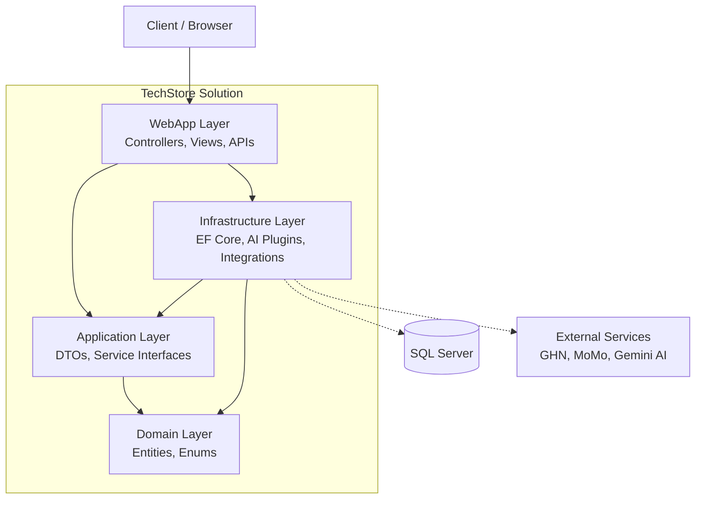

# 🛒 TechStore - Electronic Components E-Commerce

[](https://www.google.com/search?q=https://dotnet.microsoft.com/download/dotnet/8.0)
[](https://www.google.com/search?q=)
[](https://www.google.com/search?q=)

**TechStore** is a full-featured e-commerce platform specifically designed for electronic components. Built on **ASP.NET Core 8 MVC**, the system integrates modern technologies including an AI Assistant (powered by Google Gemini), MoMo e-wallet payments, and GHN (Giao Hàng Nhanh) for logistics and shipping fee calculation.

## 🏗 System Architecture

The project follows a standard **Layered Architecture** to ensure separation of concerns, maintainability, and scalability.



  * **WebApp**: User Interface (MVC), Controllers, Admin Area, and API endpoints.
  * **Application**: Data Transfer Objects (DTOs) and Service Interfaces.
  * **Domain**: Core business entities and enumerations.
  * **Infrastructure**: Entity Framework Core data access, Business Services, and 3rd-party integrations (AI, Payment, Shipping).

-----

## 🚀 Key Features

### 👤 Customer Portal

  * **Shopping Experience:** Browse featured products, view details, read/write reviews, and utilize advanced search/filter/sort functionalities.
  * **Cart & Comparison:** Manage shopping cart and compare technical specifications of electronic components side-by-side.
  * **Checkout Flow:**
      * Real-time shipping fee calculation and address lookup via **GHN API**.
      * Secure payment processing via **MoMo API**.
  * **Order Tracking:** Track checkout progress and view order history.

### 🛡 Admin Dashboard

  * **Content Management:** Full CRUD operations for Products, Categories, and Brands.
  * **Order Fulfillment:** Manage orders, update statuses, and synchronize shipping codes directly with GHN.
  * **Analytics:** Dashboard overview of sales and system metrics.

### 🤖 AI Assistant (Semantic Kernel + Gemini)

The platform features a built-in, role-aware AI Assistant accessible via `POST /api/chat/chat`:

  * **Customer Tools:** Assists users with product recommendations, cart management, checking order status, and answering store-related questions.
  * **Admin Tools:** Empowers administrators to query reports, manage products, and handle order inquiries using natural language.

-----

## 💻 Tech Stack

  * **Backend:** ASP.NET Core MVC 8.0, Entity Framework Core
  * **Database:** SQL Server
  * **Security:** ASP.NET Core Identity (Roles: `Admin`, `User`)
  * **Integrations:** \* **AI:** Semantic Kernel, Google Gemini API
      * **Payment:** MoMo API
      * **Shipping:** GHN (Giao Hàng Nhanh) API

-----

## 🛠 Getting Started

### 1\. Prerequisites

  * [.NET 8.0 SDK](https://www.google.com/search?q=https://dotnet.microsoft.com/download/dotnet/8.0)
  * SQL Server
  * API Keys for Gemini, GHN, and MoMo.

### 2\. Configuration

Configure the required settings in `WebApp/appsettings.json`. For local development, it is highly recommended to use **User Secrets** to keep your keys safe:

```powershell
cd WebApp
dotnet user-secrets set "Gemini:ApiKey" "<your-gemini-api-key>"
dotnet user-secrets set "GHN:Token" "<your-ghn-token>"
dotnet user-secrets set "GHN:ShopId" "<your-shop-id>"
dotnet user-secrets set "GHN:ShopDistrictId" "<your-shop-district-id>"
```

*Note: The GHN base configuration is bound in `Program.cs`.*

### 3\. Database Migration

Run the following command from the repository root to apply migrations and create the database schema:

```powershell
dotnet ef database update --project Infrastructure --startup-project WebApp
```

### 4\. Run the Application

```powershell
dotnet run --project WebApp
```

Once running, open the provided HTTPS URL (usually `https://localhost:xxxx`) in your browser.

-----

## 📁 Project Structure

```text
TechStore/
├─ WebApp/
│  ├─ Controllers/
│  ├─ Areas/Admin/Controllers/
│  ├─ Views/
│  └─ Program.cs
├─ Application/
│  ├─ Interfaces/
│  └─ DTOs/
├─ Domain/
│  ├─ Entities/
│  └─ Enums/
└─ Infrastructure/
   ├─ Data/
   ├─ Services/
   ├─ Plugins/
   └─ Migrations/
```
